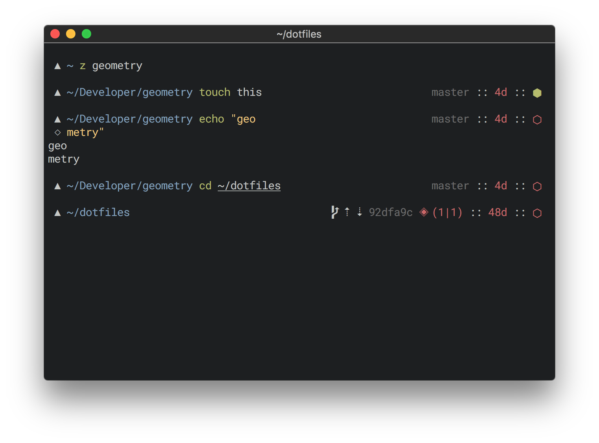

# geometry

geometry is a minimal, customizable zsh prompt theme.

I started chopping away at [Avit](https://github.com/robbyrussell/oh-my-zsh/blob/master/themes/avit.zsh-theme) until I ended up with something minimal and inspired on [Pure](https://github.com/sindresorhus/pure).

What it does:

- display current git branch
- display colored time since last commit (optional)
- display state (clean/dirty) of the repo
- display arrows indicating if you need to pull, push or if you are mid-rebase
- set the terminal title to current command and directory
- display the number of git conflicts and total conflicts (optional)
- colorize the ▲ based on the current hostname (optional)
- colorize the ▲ when running under root user (optional)
- make you the coolest hacker in the whole Starbucks

Much like [Pure](https://github.com/sindresorhus/pure), geometry adds a different marker
if the last command result is different from `0`. It also sets the title to
`[command @] directory`. Check the title and marker here:

## Installing

### antigen

Just add `antigen bundle frmendes/geometry` to your `.zshrc`.

### oh-my-zsh

Move `geometry.zsh` to `$HOME/.oh-my-zsh/custom/themes/geometry.zsh-theme` and
set `ZSH_THEME="geometry"` in your `.zshrc`.

### zplug

Add `zplug "frmendes/geometry"` to your `.zshrc`

### Dependencies

The symbol for rebasing comes from a [Powerline patched font](https://github.com/powerline/fonts). If you want to use it, you're going to need to install one from the font repo. The one used in the screenshots is Roboto Mono. You can also try to [patch it yourself](https://github.com/powerline/fontpatcher).

Alternatively, change the symbol by setting the `GEOMETRY_SYMBOL_GIT_REBASE` variable. [See options](#options)

### Options

geometry has plenty of customization options available. Just set the variables in the
beginning of the `geometry.zsh` file to whatever you like! You can also set the custom options in
your `.zshrc` before loading the prompt. See my
[dotfiles](https://github.com/frmendes/dotfiles) where I [set the options for
geometry](https://github.com/frmendes/dotfiles/blob/master/system/prompt.zsh#L17-L22)
before [loading antibody](https://github.com/frmendes/dotfiles/blob/master/zsh/zshrc.symlink#L10-L14).

#### git conflicts

You can optionally have the prompt display both the number of files with
conflicts as well as the total number of conflicts by setting the
`PROMPT_GEOMETRY_GIT_CONFLICTS` variable to true.

This option uses `grep` and `ag` with the latter being a [much faster alternative](http://geoff.greer.fm/ag/).

**If you don't have `ag` installed, this might slow your prompt down**.

#### git time since last commit

You can optionally hide the time since last commit by setting the
`PROMPT_GEOMETRY_GIT_TIME` variable to false. You might want to
do this if the prompt is too slow on large repositories.

#### colorized symbol ▲

You can optionally have the ▲ (or whatever `GEOMETRY_PROMPT_SYMBOL` you set)
change colors based on a simple hash of your hostname by setting the
`PROMPT_GEOMETRY_COLORIZE_SYMBOL` variable to true.

#### colorize root

You can have your prompt symbol change colors when running under the root user.

To activate this option, just set `PROMPT_GEOMETRY_COLORIZE_ROOT` to true. Symbol and color can be customized by changing the `GEOMETRY_SYMBOL_ROOT` and `GEOMETRY_COLOR_ROOT` variables.

Note that this option overrides the color hashing of your prompt symbol.
